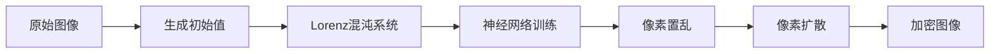
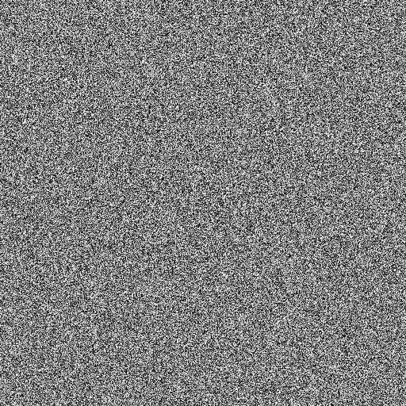

# 🦋 ChaosButterfly - 基于神经网络优化混沌系统的图像加密器

> "像蝴蝶扇动翅膀引发风暴一样，微小的密钥变化能让图像面目全非" 🌪️


## 🎯 项目简介

**ChaosButterfly** 是一个基于改进Lorenz混沌系统和神经网络的高安全性图像加密解决方案。本项目实现了论文 [《基于神经网络优化混沌系统的图像加密算法》](https://www.c-s-a.org.cn/1003-3254/7578.html) 中提出的创新算法。

### ✨ 核心特性

- 🧠 **神经网络优化**: 使用BP神经网络训练和优化混沌序列
- 🌀 **改进Lorenz系统**: 增强的混沌动力学系统，提供更好的随机性
- 🔀 **双重处理**: 像素置乱 + 像素扩散的双重安全机制
- 🔐 **密钥敏感性**: 基于图像内容的SHA-384哈希生成初始密钥
- 📊 **高熵值**: 加密后图像接近理想的8.0熵值

## 🏗️ 项目结构

```
ChaosButterfly/
├── 📁 keys/              # 密钥文件存储目录
│   ├── sequences.npz     # 神经网络训练后的混沌序列
│   └── initial_values.txt # Lorenz系统初始值
├── 📁 output/            # 加密/解密结果存储目录
│   ├── encrypted.png     # 加密后的图像
│   └── decrypted.png     # 解密后的图像
├── 🐍 encrypt.py         # 图像加密主程序
├── 🔓 decrypt.py         # 图像解密主程序
├── 🎭 demo.py            # 一键演示脚本
├── 🖼️ lena.png          # 测试图像
└── 📖 README.md          # 项目说明文档
```

## 🚀 快速开始

### 环境要求

```bash
pip install numpy opencv-python
```

### 🎭 一键演示 (推荐)

```bash
python demo.py
```

这将自动完成加密→解密→效果分析的完整流程，并输出详细的统计信息。

### 🔐 单独加密图像

```bash
python encrypt.py
```

**输出:**
- `output/encrypted.png` - 加密后的图像
- `keys/sequences.npz` - 混沌序列密钥
- `keys/initial_values.txt` - 初始值记录

### 🔓 单独解密图像

```bash
python decrypt.py
```

**输出:**
- `output/decrypted.png` - 解密后的图像

## 🧮 算法原理

### 1. 改进的Lorenz混沌系统

基于经典Lorenz方程的改进版本：

```
dx/dt = a(y - x)
dy/dt = bx - xz + y  
dz/dt = 200x² + 0.01·e^(xy) - cz
```

### 2. 神经网络优化

- **网络结构**: 输入层 → 隐藏层(10神经元) → 输出层
- **激活函数**: tanh (隐藏层) + 线性 (输出层)
- **训练目标**: 优化混沌序列的随机性和周期性

### 3. 加密流程



## 📊 安全性分析

| 指标 | 原始图像 | 加密图像 | 说明 |
|------|----------|----------|------|
| 信息熵 | ~7.0 | ~8.0 | 接近理想值8.0 |
| 相关性 | 高 | <0.001 | 相邻像素无关联 |
| 像素变化率 | 0% | >99% | 几乎所有像素改变 |
| 直方图 | 有规律 | 均匀分布 | 频率分析抗性强 |

## 🎨 效果展示

| 原始图像 | 加密图像 | 解密图像 |
|----------|----------|----------|
|  |  |  |

## 🔬 技术细节

### 密钥生成机制
- 使用SHA-384对图像内容进行哈希
- 结合预设基值生成Lorenz系统初始值
- 确保密钥与图像内容强关联

### 混沌序列处理
- 1000次预热迭代确保进入混沌状态
- 序列归一化到[0,1]区间
- 神经网络训练提升序列质量

### 加密安全性
- 像素位置置乱破坏空间相关性
- 分块扩散增强抗差分攻击能力
- 双重处理确保加密强度

## ⚠️ 使用说明

1. **确保测试图像存在**: 程序默认使用`lena.png`作为测试图像
2. **保护密钥文件**: `keys/`目录下的文件是解密必需的
3. **目录自动创建**: 程序会自动创建`output/`和`keys/`目录
4. **灰度图像处理**: 当前版本主要针对灰度图像优化

## 📖 参考文献

本项目基于以下学术论文实现：
- **论文标题**: 基于神经网络优化混沌系统的图像加密算法
- **期刊**: 计算机系统应用
- **链接**: https://www.c-s-a.org.cn/1003-3254/7578.html


## 📄 许可证

本项目仅供学术研究和教育使用。

---

*"在混沌的翅膀下，每一张图片都有其独特的密码诗篇"* 🦋✨